# **🍽️ Reto Técnico - Backend Node.js (Microservicios con AWS ECS) 🚀**

Este repositorio contiene la solución al **reto técnico de Backend Node.js** propuesto por **Alegra**. La aplicación simula un sistema de pedidos en un restaurante que ofrece platos gratuitos, siguiendo una arquitectura basada en **microservicios** con **Fastify**, **Redis** y **Docker**, desplegados en **AWS ECS**.

---

## **📌 Descripción del Proyecto**
El sistema permite a un gerente solicitar platos a la cocina. La cocina selecciona aleatoriamente una receta y solicita los ingredientes a la bodega. Si la bodega no tiene suficientes ingredientes, realiza una compra en la plaza de mercado. Una vez que los ingredientes están disponibles, el plato se prepara y se entrega.

### **⚙️ Arquitectura**
- **`orders-app`**: Maneja las órdenes de comida generadas por los usuarios.
- **`kitchen-app`**: Procesa las órdenes y solicita ingredientes a la bodega.
- **`inventory-app`**: Administra los ingredientes y gestiona las compras en la plaza de mercado.

Los microservicios se comunican mediante **WebSockets** y **Redis**, garantizando asincronismo y procesamiento masivo de pedidos.

---

## **🛠️ Tecnologías Utilizadas**
✅ **Node.js** con **Fastify**  
✅ **Docker** y **Docker Compose**  
✅ **Redis** para comunicación entre microservicios  
✅ **AWS ECS Anywhere** para despliegue en la nube  
✅ **GitHub Actions** para CI/CD  
✅ **MongoDB/PostgreSQL (opcional, si se requiere persistencia)**  
✅ **Frontend** [🔗 Enlace aquí]

---

## **🚀 Despliegue en AWS ECS**
Los microservicios se despliegan en **AWS ECS Anywhere**, usando el nivel gratuito de **2200 horas al mes**.  
La infraestructura está gestionada dentro de un **monorepo**, con imágenes Docker alojadas en **Amazon ECR** y un flujo CI/CD automatizado con **GitHub Actions**.

---

## **📝 Requisitos del Reto**
✔️ Arquitectura de **microservicios con Docker**  
✔️ Soporte para **pedidos masivos**  
✔️ Comunicación **asincrónica** entre servicios  
✔️ **Visibilidad en tiempo real** de órdenes y stock  
✔️ **Despliegue gratuito** en un servidor accesible  

---

## **📂 Estructura del Repositorio**
```
📺 alegra-challenge
├── 📺 orders-app       # Microservicio de órdenes
├── 📺 kitchen-app      # Microservicio de cocina
├── 📺 inventory-app    # Microservicio de bodega
├── 📺 infra            # Configuración de AWS ECS
├── 📺 .github/workflows # GitHub Actions (CI/CD)
├── 📺 README.md        # Documentación del proyecto
```
---

## **Diagrama de Flujo**

```mermaid
graph TB
    User((Customer))
    ExternalMarket["External Market API<br>Farmers Market"]

    subgraph "Restaurant System"
        subgraph "Orders Service"
            OrdersApp["Orders App<br>Fastify"]
            
            subgraph "Orders Components"
                OrdersRoutes["Routes Handler<br>Fastify Routes"]
                OrdersService["Orders Service<br>Node.js"]
                OrdersSchema["Orders Schema<br>JSON Schema"]
                PostgresPlugin["Postgres Plugin<br>@fastify/postgres"]
                RedisPlugin["Redis Plugin<br>@fastify/redis"]
            end
        end

        subgraph "Kitchen Service"
            KitchenApp["Kitchen App<br>Fastify"]
            
            subgraph "Kitchen Components"
                KitchenRoutes["Routes Handler<br>Fastify Routes"]
                RecipeService["Recipe Service<br>Node.js"]
                QueueService["Queue Service<br>Node.js"]
                KitchenSchema["Recipe Schema<br>JSON Schema"]
                KitchenPostgres["Postgres Plugin<br>@fastify/postgres"]
                KitchenRedis["Redis Plugin<br>@fastify/redis"]
            end
        end

        subgraph "Inventory Service"
            InventoryApp["Inventory App<br>Fastify"]
            
            subgraph "Inventory Components"
                InventoryRoutes["Routes Handler<br>Fastify Routes"]
                InventoryService["Inventory Service<br>Node.js"]
                InventorySchema["Inventory Schema<br>JSON Schema"]
                MongoPlugin["MongoDB Plugin<br>@fastify/mongodb"]
                WebsocketPlugin["Websocket Plugin<br>@fastify/websocket"]
            end
        end

        subgraph "Data Stores"
            PostgresDB[("PostgreSQL<br>Orders & Recipes")]
            MongoDB[("MongoDB<br>Inventory")]
            Redis[("Redis<br>Message Broker")]
        end
    end

    %% User interactions
    User -->|Places order| OrdersApp
    
    %% Service interactions
    OrdersApp -->|Publishes updates| Redis
    KitchenApp -->|Subscribes to updates| Redis
    InventoryApp -->|Purchases ingredients| ExternalMarket
    
    %% Component interactions within Orders Service
    OrdersApp -->|Uses| OrdersRoutes
    OrdersRoutes -->|Uses| OrdersService
    OrdersService -->|Validates| OrdersSchema
    OrdersService -->|Stores data| PostgresDB
    OrdersApp -->|Connects via| PostgresPlugin
    OrdersApp -->|Messaging via| RedisPlugin

    %% Component interactions within Kitchen Service
    KitchenApp -->|Uses| KitchenRoutes
    KitchenRoutes -->|Uses| RecipeService
    KitchenRoutes -->|Uses| QueueService
    RecipeService -->|Validates| KitchenSchema
    QueueService -->|Processes orders| RecipeService
    KitchenApp -->|Connects via| KitchenPostgres
    KitchenApp -->|Messaging via| KitchenRedis
    
    %% Component interactions within Inventory Service
    InventoryApp -->|Uses| InventoryRoutes
    InventoryRoutes -->|Uses| InventoryService
    InventoryService -->|Validates| InventorySchema
    InventoryService -->|Stores data| MongoDB
    InventoryApp -->|Connects via| MongoPlugin
    InventoryApp -->|Real-time updates via| WebsocketPlugin

    %% Database connections
    PostgresPlugin -->|Connects to| PostgresDB
    KitchenPostgres -->|Connects to| PostgresDB
    MongoPlugin -->|Connects to| MongoDB
    RedisPlugin -->|Connects to| Redis
    KitchenRedis -->|Connects to| Redis
```



---

## **🔗 Instrucciones de Uso**
1. **Clonar el repositorio**  
   ```bash
   git clone https://github.com/MichaelAuditore/alegra-challenge
   cd alegra-challenge
   ```

2. **Configurar variables de entorno**  
   - Copiar el archivo `.env.example` en cada microservicio y completar con valores.

3. **Ejecutar localmente con Docker Compose**  
   - Configurar la variable de entorno `PURCHASE_URL` en docker-compose.yaml.

   - Si tienes instalado el plugin de Docker Compose (versión v2 integrada en el CLI de Docker), ejecuta:
      ```bash
      docker compose up --build
      ```

   - Si usas la versión independiente (standalone), ejecuta:
      ```
      docker-compose up --build
      ```
   - Una vez que ha sido desplegado, podrás acceder a cada uno de los servicios y su documentación Swagger:

   **Orders API**

    - `localhost:3000/health` - Valida la operatividad del servicio.
    - `localhost:3000/documentation` - Muestra documentación interactiva Swagger.

   **Kitchen API**

    - `localhost:3001/health` - Valida la operatividad del servicio.
    - `localhost:3001/documentation` - Muestra documentación interactiva Swagger.

   **Inventory API**

    - `localhost:3002/health` - Valida la operatividad del servicio.
    - `localhost:3002/documentation` - Muestra documentación interactiva Swagger.

---

5. **📖 Database Setup**
Este proyecto utiliza **PostgreSQL** y **MongoDB**.  
A continuación, se describe la estructura de la base de datos basada en los scripts de inicialización.

    ### **📌 PostgreSQL Structure**
    📂 `postgres/init.sql`  
    Este script crea las tablas y relaciones necesarias en PostgreSQL.

    #### **📜 Tables & Schema**
    ```sql
    -- Orders Table
    CREATE TABLE orders (
        id UUID PRIMARY KEY DEFAULT gen_random_uuid(),
        recipe_id UUID REFERENCES recipes(id) ON DELETE SET NULL,
        created_at TIMESTAMP DEFAULT now()
    );

    -- Orders Processing Table
    CREATE TABLE orders_processing (
        id SERIAL PRIMARY KEY,
        order_id UUID REFERENCES orders(id) ON DELETE CASCADE,
        progress_status TEXT NOT NULL CHECK (progress_status IN ('pending', 'cooking', 'ready', 'unknown')),
        last_updated TIMESTAMP DEFAULT now()
    );

    -- Recipes Table
    CREATE TABLE recipes (
        id UUID PRIMARY KEY DEFAULT gen_random_uuid(),
        key_name TEXT UNIQUE NOT NULL,
        description TEXT,
        image_url TEXT
    );
    ```

    #### **🔹 How to Run PostgreSQL Init Script**
    ```sh
    docker exec -i postgres psql -U user -d mydb < postgres/init.sql
    ```

    ---

    ### **📌 MongoDB Structure**
    📂 `mongo/init-mongo.js`  
    Este script inicializa la base de datos de MongoDB con la colección `ingredients`.

    #### **📜 Collections**
    ```js
    db.createCollection("ingredients");
    db.createCollection("purchases");

    // Seed Data
    db.ingredients.insertMany([
    { key_name: "rice", stock: 100, unit: "kg" },
    { key_name: "meat", stock: 50, unit: "kg" },
    { key_name: "vegetables", stock: 30, unit: "kg" },
    { key_name: "spices", stock: 20, unit: "g" },
    { key_name: "cheese", stock: 15, unit: "kg" }
    ]);
    ```

    #### **🔹 How to Run MongoDB Init Script**
    ```sh
    docker-compose down -v  # Remove old data
    docker-compose up -d    # Start MongoDB with seeding
    ```
    To verify:
    ```sh
    docker exec -it mongo mongosh
    use restaurant
    db.ingredients.find().pretty()
    ```

    ---

    ### **🛠️ How to Access the Databases**
    #### **🔹 PostgreSQL**
    ```sh
    docker exec -it postgres-db psql -U user -d mydb
    ```
    #### **🔹 MongoDB**
    ```sh
    docker exec -it mongo mongosh
    ```

    ---

    ### **✅ Summary**
    | Database  | Type        | Collections / Tables |
    |-----------|------------|----------------------|
    | PostgreSQL | Relational | `orders`, `orders_processing`, `recipes` |
    | MongoDB   | NoSQL       | `ingredients`, `purchases` |

    ---
    🚀 Para mas información visita los ficheros: [init.sql](./postgres/init.sql) [init-mongo.js](./mongo/init-mongo.js)

---

5. **Desplegar en AWS ECS**  
   El despliegue es automático a través de **GitHub Actions**. Cada push a `main` reconstruye y actualiza los servicios en **AWS ECS**.

   Se bloque la rama main para que el proceso de ejecución de actions se haga después de completar un Pull Request

---

## **📊 Estado del Despliegue**
🔗 **URL de la aplicación:** [🔗 [Enlace aquí](my-app-loadbalancer-923472619.us-east-2.elb.amazonaws.com)]  
🔗 **Repositorio en GitHub:** [🔗 [Enlace aquí](https://github.com/MichaelAuditore/alegra-challenge)]  


## **Funcionamiento aplicación**
los service-name disponibles para la app publicada en la URL anteriormente mencionada son:

- orders-service
- kitchen-service
- inventory-service

Nota: /`service-name`/v1/documentation -> muestra la documentación de la API.

---

## *Operación de Actualización Ordenes*

* Estado inicial `unknown` mientras se define la receta.
* Estado posterior `pending` cuando hay ingredientes disponibles y se ha seleccionado la receta.
* Estado posterior `cooking`, la orden cambia de estado a los 30seg despues de estar en estado `pending`.
* Estado posterior `ready`, la orden cambia el estado a los 60seg después de haber estado en estado `cooking`

## **📌 Autor**
**Miguel Ángel Parada Cañón**  
💻 Desarrollador Fullstack | Arquitectura de Microservicios | AWS | Fastify  

---
